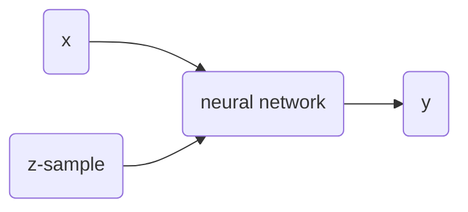

# Approximating Stochastic Data Sets

## Introduction

Neural networks are [universal function approximators][UAT]. Which means that having enough hidden neurons a neural network can be used to approximate any continuous function. Real life data, however, often has noise or hidden variables which makes approximation inaccurate and in other cases over trained. At best, the prediction settles on the mean of the immediate vicinity. In **Fig. 1** we can see that using a neural network to approximate a noisy data set fails to capture all the information.

|                                                              |
| :----------------------------------------------------------: |
|  |
| **Fig. 1** Approximation of  with added normal noise |

Because of this it is useful to a have a model that instead of producing a single prediction value for a given input value, produces an arbitrary set of predictions mirroring the dataset distribution at that input.

## The Method

Given that the function producing the data has a specific distribution  at input  [^1] we can define the target function, or the function we actually want to approximate, as . We want to create an algorithm capable of sampling an arbitrary number of data points from  [^2] for any given .

To do this we introduce a secondary input  that can be sampled from uniformly distributed space  [^3] by the algorithm and fed to a deterministic function  where  is a possible value of the target function with probability . That is .

Or put another way, we want a deterministic function that maps an input , a random (but uniform) variable  to a dependent random variable .

[^1]:  is the n-dimensional continuous domain of the target function.
[^2]:  is a dependent random variable in an n-dimensional continuous space. The probability function must be continuous on . In this article and the provided source code  is assumed to be 1-dimensional.  
[^3]:  is a uniformly distributed random variable in an n-dimensional continuous space with a predefined range, however in this article and the provided code  is always assumed to be 1-dimensional.

## Model

The proposed model to approximate  is an ordinary feed forward neural network that in addition to an input  also takes an input  that can be sampled from .

### Overview

At every point  we want  to approximate the  distribution to an arbitrary precision. Let's picture  and  as 2-dimensional (in the case where  and  are both 1-dimensional) pieces of fabric, they can stretch and shrink in different measures at different regions, decreasing or increasing it's density respectively. We want a mechanism that stretches and shrinks  in a way that matches the shrinks and stretches in .

|                                                              |
| :----------------------------------------------------------: |
|  |
| **Fig 2** An animation of the training to match  with added uniform noise. |

In **Fig 2** we can see how the trained model output stretches and shrinks little by little on each epoch until it matches target function.

Going on with the stretching and shrinking piece of fabric analogy, we want to put "pins" into this fabric so that we can superimpose it over the underlying fabric that we are trying to match. We will put these pins into fixed points in the fabric but we will move them to different places of the underlying fabric as we train the model. At first we will pin them to random places. As we observe the position of the pins on the underlying fabric relative to the fabric we will move them slightly upwards or downwards to improve the fabric's match on the underlying fabric. Every pin will affect its surroundings in the fabric proportionally to distance from the pin.

We'll start by putting 1 pin in any given latitude of the fabric and at the midpoint longitude across the fabric's height. We'll then make many observations in the underlying fabric at the same latitude, that is we will randomly pick several locations at the vertical line that goes through the selected pin location.

For every observed point, we'll move the pin position in the underlying fabric a small predefined distance downwards if the observed point is below its current position, and we'll move it upwards if it is above it. This means that if there are more observed points above the pin's position in the underlying fabric the total movement will be upwards and vice versa if there are more observed points below it. If we repeat this process enough times, the pin's position in the underlying fabric will settle in a place that divides the observed points by half, that is the same amount of observed points are above it as below it.
|                                                              |
| ------------------------------------------------------------ |
|  |
| **Fig 3** Moving 1 pins towards observed points until it settles. |

The pin comes to a stable position dividing all data points in half because the amount of movement for every observation is equal for data points above and below. If the predefined distance of movement for observations above is different from the predefined distance of movement for observations below then the pin would settle in a position dividing the data points by a different ratio (different than half). For example, let's try having 2 pins instead of 1, the first one will move 1 distance for observations above it and 0.5 distance for observations below, the second one will do the opposite. After enough iterations the first one should settle at a position that divides the data points by  above and  below while the second pin will divide by  above and  below. This means we'll have  above the first pin,  between both pins and  below the second pin.

|                                                              |
| ------------------------------------------------------------ |
|  |
| **Fig 4** Moving 2 pins towards observed points until they settle. |

If  a pin divides the observed data points in 2 groups of sizes  and  and after training its fixed position settles in the underlying fabric in the  longitude from the top, we have a single point mapping between the 2 fabrics, that is at this latitude the densities above and below the pin are equal in both pieces of fabric. We can extrapolate this concept and create as many pins as we want in order to create a finer mapping between the 2 pieces of fabric.

### Definition

We'll start by selecting a fixed set of points in   of size  that we will call ***z-samples***. We can define this set as .

And we define our goals to train  as:
###### Goal 1

\forall x \in X \and \forall z' \in z_{samples}: Pr(f(x, z') >= Y_{x}) = Pr(z' >= Z)

In other words, we want that for every  in  and across the entire  input space the cumulative distribution functions  and  have the same value. This first goal gives us a discrete finite mapping between the ***z-samples*** set and . Although it doesn't say anything about all the points  in  that are not in .

###### Goal 2

\forall x \in X \and \forall z', z'' \in Z \space s.t. \space z' < z'': f(x, z') < f(x, z'')

This second goal gives us that for any given  in   is monotonically increasing function in .

Both of these goals will be tested empirically during the testing step of the training algorithm.

If we assume that these goals are met we have that for any point  and with  and  being the points in the ***z-samples*** set that are immediately smaller and greater respectively we have that:

\forall x \in X: Pr(f(x, z') >= Y_{x}) = Pr(z' >= Z) < \mathbf{Pr(z >= Z)} < Pr(f(x, z'') >= Y_{x}) = Pr(z'' >= Z)

and

\forall x \in X: Pr(f(x, z') >= Y_{x}) = Pr(z' >= Z) < \mathbf{Pr(f(x, z) >= Y_{x})} < Pr(f(x, z'') >= Y_{x}) = Pr(z'' >= Z)

From this we have that:

\forall x \in X: |Pr(z >= Z) - Pr(f(x, z) >= Y_{x})| < Pr(z'' >= Z) - Pr(z' >= Z) = Pr(f(x, z'') >= Y_{x}) - Pr(f(x, z') >= Y_{x})

What this means is that for any point  the error of , which an be defined as = Z) - Pr(f(x, z) >= Y_{x})|">, is always smaller than = Z) - Pr(z' >= Z)"> or = Y_{x}) - Pr(f(x, z') >= Y_{x})"> which (since  is monotonically increasing in  for any given  ) can be minimized by making  smaller. This can be achieved by increasing the number of ***z-samples*** or . In other words the maximum error of  can be arbitrarily minimized by a sufficiently large .

\exists z_{samples} \subset Z, \forall \epsilon : |Pr(z >= Z) - Pr(f(x, z) >= Y_{x})| < \epsilon

Having defined our goals and what will they buy us, we move to show how we will achieve [Goal 1](#Goal-1). For simplicity we will use a ***z-samples*** set that is evenly distributed in , that is:  Z > z_{0}) = Pr(z_{2} > Z > z_{1}), ... , Pr(z_{s} > Z > z_{s-1})">.

For any given  in  and any  in  we want  to satisfy = Y_{x}) = Pr(z' >= Z)">. For this purpose we'll assume that we count with a sufficiently representative set of samples in  or .

For a given  if  was the midpoint in  (i.e.  Z) = 0.5">) we could simply train  to change the value of  a constant movement number  greater for every training example  that was greater than  itself and the same constant number smaller for every training example that was smaller. This would cause after enough iterations for the value of  to settle in a position that divides in half all training examples when the total movement equals 0.

If instead of being 's midpoint  Z) \ne 0.5"> then the constant numbers of movement for greater and smaller samples have to be different.

Let's say that  is the distance between  and the smallest number in  or , and  the distance between  and .

a = z' - Z_{min}

b = Z_{max} - z'

Since  represents the amount of training examples we hope to find smaller than  and  the amount of training examples greater than  we need 2 scalars  and  to satisfy the following equations:

\alpha a = \beta b

These scalars will be the multipliers to be used with the constant movement  on every observed point smaller and greater than  respectively. This first equation assures that the total movement when  is situated at  or  will be 0.

\alpha a + \beta b = 1

This second equation normalizes the scalars so that the total movement for all  in  have the same total movement.

Which gives us:

\alpha = 1 / (2  a)

\beta = 1 / (2 b)

This logic however, breaks at the edges, that is when a *z-sample* is equal to  or . At these values either  or  is 0 and if either of them is 0 then one of  or  is undefined.

As  or  approach 0  or  tend to infinity, one might be tempted to replace this with a large number, but that would not be practical because a large distance multiplier would dominate the training and minimize the movement of other .

Also as one of  or  tend to infinity the other one becomes a small number that is also impractical but for a different reason. The  at the edges are supposed to map to the edges of  and any quantity of movement into the opposite direction will result in  or  mapping to a greater or smaller point in  respectively. For this reason the  and  for the  at the edges (i.e.  and ) will be assigned a value of 0 for the one that pushes inward and a predefined constant  that can be adjusted to the model.

## Training the model

In order to train the neural network the *z-samples* set size  is chosen depending on the desired accuracy and compute available. Having decided the training level  must be defined. That is, the number of dimensions and its range must be chosen. Given  and the training level we can create the *z-samples* set.

For example if  is 1-dimensional with range defined as  and  9, we have that the *z-sample* set is .

First we select a batch of data from the training data with size , for every data point in the batch, we evaluate the current model on every *z-sample*. This gives us the prediction matrix:

\begin{bmatrix}
f(x_{0}, z_{0}), f(x_{1}, z_{0}), ..., f(x_{0}, z_{S})\\
f(x_{1}, z_{0}), f(x_{1}, z_{1}), ..., f(x_{1}, z_{S})\\
...\\
f(x_{n}, z_{0}), f(x_{n}, z_{1}), ..., f(x_{n}, z_{S})\\
\end{bmatrix}

For every data point  in the batch, we take the output value  and compare it with every value of its corresponding row in the prediction matrix (i.e. ). After determining if  is greater or smaller than each predicted value, we produce 2 values for every element in the matrix:

###### Weight
The weight is the scalar  if  is smaller than the prediction and  if  is greater.

w_{i, z-sample} = \left\{\begin{array}{11}
\alpha_{z-sample} & y_{i} < f(x_{i}, z_{z-sample})\\
\beta_{z-sample} & y_{i} > f(x_{i}, z_{z-sample})\\
\end{array}\right.

###### Target Value
The target value is the prediction itself plus the preselected movement constant  multiplied by -1 if  is smaller than the prediction and 1 if  is greater. You can think of target values as the "where we want the prediction to be" value.

t_{i, z-sample} = \left\{\begin{array}{11}
f(x_{i}, z_{z-sample}) + M & y_{i} < f(x_{i}, z_{z-sample})\\
f(x_{i}, z_{z-sample}) - M & y_{i} > f(x_{i}, z_{z-sample})\\
\end{array}\right.

After calculating these 2 values we are ready to assemble the matrix to be used during backpropagation.

\begin{bmatrix}
(w_{0,0}, t_{0,0}), (w_{0,1}, t_{0,1}), ... , (w_{0,S}, t_{0,S})\\
(w_{1,0}, t_{1,0}), (w_{1,1}, t_{1,1}), ... , (w_{1,S}, t_{1,S})\\
...\\
(w_{n,0}, t_{n,0}), (w_{n,1}, t_{n,1}), ... , (w_{n,S}, t_{n,S})\\
\end{bmatrix}

We pass the prediction matrix results in a addition to this matrix to a Weighted Mean Squared Error loss function (WMSE). The loss will look like this:

\sum_{j=0}^{S}\sum_{i=0}^{n}(f(x_{i}, z_{j}) - t_{i,j})^2 * w_{i,j}

## Testing the model

The Mean Squared Error (MSE) loss function works to train the model using backpropagation and target values, but testing the model requires a different approach. Since the  and  are random, measuring the differences between them is pointless. Because of this, the success of the model will be measured in 2 ways:

### Earth Movers Distance (EMD)

> In statistics, the **earth mover's distance** (**EMD**) is a measure of the distance between two probability distributions over a region *D*. In mathematics, this is known as the Wasserstein metric. Informally, if the distributions are interpreted as two different ways of piling up a certain amount of dirt over the region *D*, the EMD is the minimum cost of turning one pile into the other; where the cost is assumed to be amount of dirt moved times the distance by which it is moved. [wikipedia.org][EMD]

Using EMD we can obtain an indicator of how similar  and  are. It can be calculated by comparing every  data point in the test data and prediction data sets and finding way to transform one into the other that requires the smallest total movement.

|      |
| ---- |
|      |
| **Fig 5** EMD testing. |

### Testing the training goals
#### Training goal 1

Ideally to test [Goal 1](#Goal-1) (i.e. = Y_{x}) = Pr(z' >= Z)">) we would evaluate  for a given  and on every  and then compare it to an arbitrary number of test data points having the same . We would then proceed to count for every  the number of test data points smaller than it. With a vector of *smaller than counts* (i.e. = Y_{x})">) we could proceed to compare it with the canonical counts for every  (i.e. = Z)">) and measure the error. In real life data sets this is not possible however. Real life data sets will not likely have an arbitrary number of data points having the same  (they will unlikely have 2 data points with the same ) which means that we need to use a vicinity in  (values  that are close to an ) to test the goal.

We start by creating an ordering (an array of indices)  that sorts all the elements in  (all the  inputs in the test data set) on dimension . Then we select an element in  and pick the  (vicinity size) samples closest to it. This gives us a subset of  consecutive elements in  which we'll call .

Now we can evaluate  for every  on every  which gives us the matrix:

\begin{bmatrix}
f(x_{o_{0}}, z_{0}), f(x_{o_{0}}, z_{1}), ... , f(x_{o_{0}}, z_{S})\\
f(x_{o_{1}}, z_{0}), f(x_{o_{1}}, z_{1}), ... , f(x_{o_{1}}, z_{S})\\
...\\
f(x_{o_{V}}, z_{0}), f(x_{o_{V}}, z_{1}), ... , f(x_{o_{V}}, z_{S})\\
\end{bmatrix}

We then proceed to compare each row with the outputs 

\begin{bmatrix}
y_{o_{0}}\\
y_{o_{1}}\\
...\\
y_{o_{V}}\\
\end{bmatrix}

and create *smaller than counts* (i.e. = Y_{x})">) which we can then compare with the canonical counts for every  (i.e. = Z)">) to measure the error in the selected vicinity.

We will create a number of such vicinities and call each error as the local errors and a vicinity covering all  and call its error the mean error.

|      |
| ---- |
|      |
| **Fig 6** Training goal 1 testing. |

#### Training goal 2

In order to test [Goal 2](#Goal-2)  we select some random points in  and a set of random points in , we run them in our model and get result matrix:

\begin{bmatrix}
f(x_{0}, z_{0}), f(x_{0}, z_{1}), ... , f(x_{0}, z_{n})\\
f(x_{1}, z_{0}), f(x_{1}, z_{1}), ... , f(x_{1}, z_{n})\\
...\\
f(x_{m}, z_{0}), f(x_{m}, z_{1}), ... , f(x_{m}, z_{n})\\
\end{bmatrix}

From here it is trivial to check that each row is monotonically increasing. To increase the quality of the check we can increment the sizes of the test point set in  and the test point set in .

## Experiments

The following are various experiments done on different datasets.

###  plus gaussian noise

Let's start with a simple example. The function  with added gaussian noise. On the left panel you can see the training evolving over the course of 180 epochs. On the top left corner of this panel you can see the goal 1 error localized over , at the end of the training you can see that the highest local error is around 2% and the global error is around 0.5%. On the top right corner of the same panel you can see the local Earth Mover's Distance (EMD). On the bottom left corner you can see a plot of the original test dataset (in blue) and the  (in orange), you can see how they represent the predicted space's mapping on the real data. On the bottom right you can see a plot of the original test dataset (in blue) and random predictions (with ), you can see as the predicted results slowly conform to the real data.

On the right panel, you can see a plot of the global goal1 error (above) and global EMD values (below) as they change over the entire training.

|      |      |
| ---- | ---- |
|      |      |
| **Fig 7** Training goal 1 testing. |  |

###  plus truncated gaussian noise

This one is a bit more complicated. An order 3 polynomial with added truncated gaussian noise, that is a normal distribution clipped at specific points.

|      |      |
| ---- | ---- |
|      |      |
| **Fig 8** Training goal 1 testing. |  |

### Double  plus gaussian noise multiplied by sin(x)

This one is quite more interesting. 2 mirroring  functions with gaussian noise scaled by  itself.

f = \left\{\begin{array}{11}
sin(x) + \mathcal{N} * sin(x) & U(0,1) <= 0.5\\
-sin(x) + \mathcal{N} * sin(x) & U(0,1) > 0.5\\
\end{array}\right.

|      |      |
| ---- | ---- |
|      |      |
| \ |  |

### Branching function plus gaussian noise

This one adds branching.

|      |      |
| ---- | ---- |
|      |      |
| **Fig 10** Training goal 1 testing. |  |

###  in one dimension  in another plus absolute normal

The next example has 2 dimensions of input.  (the first dimension) is  and  (the second dimension) is .

|      |
| :--: |
||
||
||
| **Fig 10** Training goal 1 testing. |

### California housing dataset

This is the classic California housing dataset.

|      |
| ---- |
||
||
||
||
||
||
||
||
||
| **Fig 10** Training goal 1 testing. |

## Conclusion

